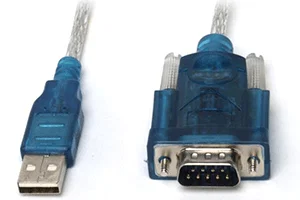

# Transmisja Interfejsu

## Sposób uruchomienia



Aby poprawnie przetestować działanie tego programu (tzw. test sprzętowej pętli zwrotnej / hardware loopback), użyłem tricku z wysyłaniem danych z portu do samego siebie. Polega to na zwarciu dwóch pinów: **TX (Transmit / Nadawanie)** oraz **RX (Receive / Odbiór)** za pomocą kawałka folii aluminiowej (lub przewodu/zworki). Dzięki temu to, co program wysyła przez nadajnik, jest natychmiastowo odbierane przez odbiornik.

### Kompilacja i uruchomienie

Aby skompilować program za pomocą kompilatora g++, wpisz w terminalu:

```bash
g++ SendText.cpp
```

Po udanej kompilacji uruchom program wpisując:

```bash
./a.exe
```

## Technologie

Program napisany w C++ dla systemu Windows. Wykorzystuje następujące technologie i biblioteki:

* **Kompilator:** g++ (MinGW-W64 13.2.0)
* **API Systemu:** Win32 API (`windows.h`) – do konfiguracji i komunikacji z portem szeregowym (użycie m.in. `CreateFile`, `WriteFile`, `ReadFile`, struktur `DCB` i `COMMTIMEOUTS`).
* **Biblioteka Standardowa C++:** strumienie wejścia/wyjścia (`iostream`), obsługa plików (`fstream`) oraz typ łańcuchowy (`string`).

[1]: https://forbot.pl/blog/port-szeregowy-interfejs-usart-czyli-komunikacja-mikrokontrolera-z-komputerem-id1122
